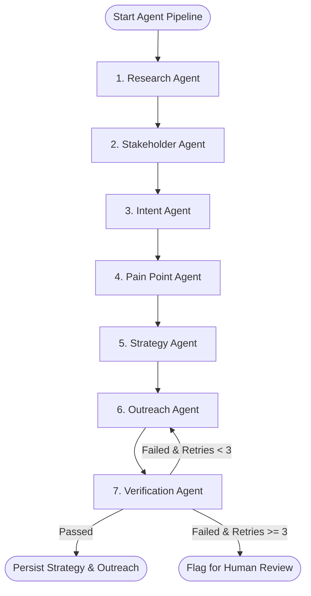

# AccountPilot AI — Agent Pipeline Architecture

## 1. Pipeline Overview

The **Agent Pipeline** in AccountPilot AI is built on **LangGraph** and **LangChain**, utilizing a State Machine DAG (Directed Acyclic Graph) architecture with conditional feedback loops. It coordinates 7 specialized AI agents to execute deep account research, stakeholder identification, intent signal scoring, pain point mapping, strategy formulation, outreach generation, and verification guardrails.

---

## 2. Agent Execution Graph



---

## 3. Core Agent Specifications

| Agent | Module Path | Primary Output Key in State | Primary Tool Dependencies |
| --- | --- | --- | --- |
| **Research Agent** | `app.agents.research` | `research_facts` | WebScraper, NewsAPI, FirmographicAPI |
| **Stakeholder Agent**| `app.agents.stakeholder`| `stakeholders` | CRMConnector, LinkedInParser, PersonaMatcher |
| **Intent Agent** | `app.agents.intent` | `intent_signals` | SignalScorer, TopicVectorSearch |
| **Pain Point Agent** | `app.agents.pain_point` | `pain_points` | RAGVectorStore, SolutionMapper |
| **Strategy Agent** | `app.agents.strategy` | `strategy_plan` | PlaybookSelector, MatrixBuilder |
| **Outreach Agent** | `app.agents.outreach` | `draft_outreach` | LLMGenerator, CitationTagger |
| **Verification Agent**| `app.agents.verification`| `verification_status` | ClaimExtractor, GroundingChecker |

---

## 4. State Management & Schema

The graph operates on an immutable-update `AgentState` data structure:

```python
from typing import TypedDict, List, Dict, Any, Optional

class AgentState(TypedDict):
    # Context IDs
    run_id: str
    workspace_id: str
    account_id: str
    product_id: str

    # Ingested Contexts
    target_account: Dict[str, Any]
    product_profile: Dict[str, Any]
    icp_criteria: Dict[str, Any]
    retrieved_documents: List[Dict[str, Any]]

    # Agent Processing Results
    research_facts: List[Dict[str, Any]]
    stakeholders: List[Dict[str, Any]]
    intent_signals: List[Dict[str, Any]]
    pain_points: List[Dict[str, Any]]
    strategy_plan: Dict[str, Any]
    draft_outreach: List[Dict[str, Any]]

    # Guardrails & Metadata
    verification_status: str  # "PASSED" | "FAILED" | "RETRYING"
    verification_feedback: List[str]
    retry_count: int
    execution_logs: List[Dict[str, Any]]
```

---

## 5. Failure Recovery & Resiliency Strategy

1. **State Persistence**: After each agent completes execution, the node status and updated `AgentState` are saved to the `agent_runs` and `agent_run_steps` database tables.
2. **Circuit Breaking & Retries**: If the `VerificationAgent` rejects generated outreach, the graph transitions back to `OutreachAgent` with specific `verification_feedback` appended to the system prompt. Maximum 3 retry loops are permitted.
3. **Graceful Fallback**: If external scraping APIs time out, the `ResearchAgent` falls back to internal cached RAG documents and flags the confidence score as `MEDIUM` instead of failing the pipeline.
